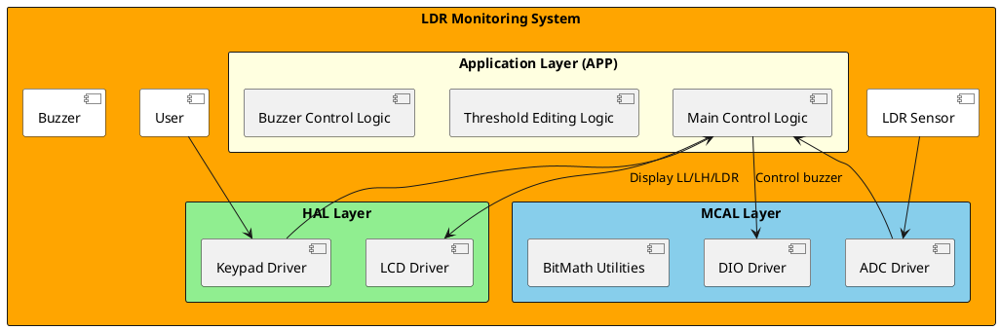
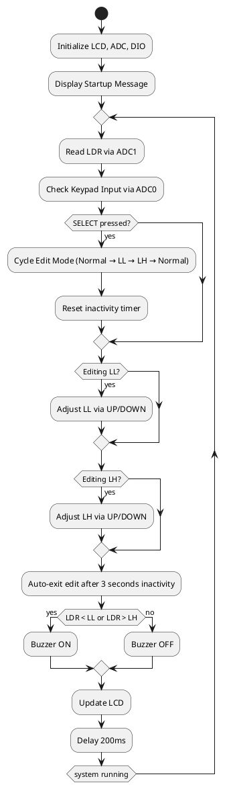
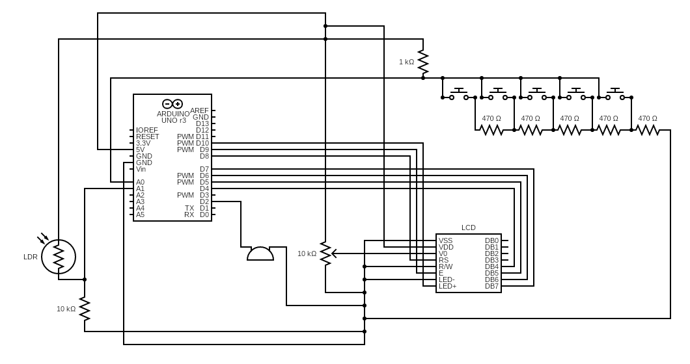
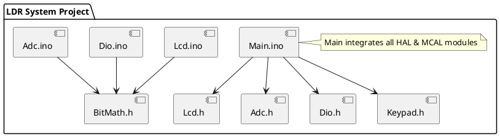

# Detailed Design Document  
| **Author**              | Hana M. Elnady - Rokaia Ayman Elsaied                                       |
|:------------------------|:-----------------------------------------------------|
| **ID**              | CU2500158 - CU2301199                          |
| **Status**              | `Approved`                          |
| **Version**             | `1.0`                                                |
| **Date**                | `16/11/2025`                                         |

---

## Introduction  
This document presents the detailed design and implementation structure of the **LDR Monitoring & Threshold Control System** developed using the **ATmega328P** microcontroller.  
The project integrates multiple MCAL and HAL modules—**ADC**, **DIO**, **LCD**, and **Keypad**—to construct a complete embedded application that reads light intensity, displays system status, allows interactive threshold editing, and triggers a buzzer when limits are exceeded.

The design follows a clear layered architecture (MCAL → HAL → APP), and all bitwise operations were abstracted using a custom **BitMath** header for improved maintainability and readability.

### Purpose  
The purpose of this design is to formally document the implementation details, flow, configuration, and integration of all software modules used in the system. This includes:  
- Reading analog LDR values  
- Threshold configuration using keypad inputs  
- Visual display of system status on the LCD  
- Activating a buzzer when limits are exceeded  

### Scope  
This document covers the full embedded software stack used to implement the system:

- **MCAL Layer:**  
  - ADC driver  
  - DIO driver  
  - BitMath utilities  

- **HAL Layer:**  
  - LCD driver  
  - Keypad driver  

- **APP Layer:**  
  - Main loop handling logic, limit editing, LCD updates, and buzzer control  

---

## Architectural Overview  

The system architecture follows a structured embedded layering approach:

### Assumptions & Constraints  

- Microcontroller: **ATmega328P (Arduino Uno)**  
- Clock: **16 MHz**  
- ADC reference: **AVCC (5V)**  
- LCD: **4-bit mode**  
- Keypad: **ADC0 (analog ladder)**  
- Buzzer: **PD2, active-high**  
- LDR: **ADC1**  
- Editing steps: increments of **10 units**  
- All drivers use BitMath for register manipulation  

---

## Functional Description  

##### **1. LDR Monitoring**  
Reads analog input from **ADC1** and displays the converted LDR value (0–1023).

##### **2. Editing LL & LH Values**  
Using the SELECT button, the user cycles through:  
- Normal mode  
- Edit LL  
- Edit LH  

UP/DOWN adjust the selected limit.  
Values stay between **0–1023**, with safety checks.

##### **3. Auto-Exit Logic**  
If no keypad input occurs for ~3 seconds while editing, the system exits to normal mode.

##### **4. Buzzer Logic**  
Turns ON when the LDR value is:  
- lower than LL  
- higher than LH  

Turns OFF otherwise.

##### **5. LCD Interface**  
The LCD shows:  
- LDR value  
- LL and LH  
- Buzzer status  
- Arrow indicating which parameter is being edited in select mode

---

## Implementation of the Module  

### Hardware schematic 

### Software  

##### **MCAL Layer**

**BitMath.h**  
Defines macros:  
- `Set_Bit`  
- `Clr_Bit`  
- `Tog_Bit`  
- `Get_Bit`  
- `WRITE_MASK`  

Used across all drivers to eliminate raw bitwise code.

**DIO Driver**  
Controls direction and output on ports B, C, D.  
Functions include:  
- Set pin direction  
- Set pin state  
- Read pin state  

**ADC Driver**  
Implements:  
- Reference selection (AVCC)  
- Channel selection  
- Conversion start  
- Blocking wait  
- Returning ADC result (0–1023)  

##### **HAL Layer**

**LCD Driver**  
Provides all LCD operations:  
- Init sequence  
- Send command  
- Send data  
- Print string  
- Cursor movement  

Works in 4-bit mode for pin efficiency.

**Keypad Driver**  
Reads ADC0 and maps ranges to:  
- UP  
- DOWN  
- SELECT  
- NO_KEY  

##### **APP Layer**

Located in **Main.ino**.  
Implements:  
- LDR acquisition  
- Button detection  
- LL/LH editing  
- Inactivity timeout  
- Buzzer control  
- LCD updates  

Runs in a continuous loop with a non-blocking structure.

---

## Integration and Configuration  

### Static Files  

| File Name        | Contents |
|------------------|----------|
| `code/BitMath.h` | Bit manipulation utilities |
| `code/Dio.h`, `code/Dio.ino` | DIO driver |
| `code/Adc.h`, `code/Adc.ino` | ADC driver |
| `code/Lcd.h`, `code/Lcd.ino` | LCD HAL |
| `code/Keypad.h`, `code/Keypad.ino` | Keypad HAL |
| `code/Main.ino` | Full application logic |

### Include Structure

If there is a complex file structure e.g. more than one c-file or more than two h-files use a diagram to explain the relationship between the source and dependent include files.

### Git Workflow & Branching Process

A sequential Git workflow was used to keep development organised and aligned with the system’s layered architecture.

**Branching Sequence**
1. **MCAL** – First branch created from main; implemented the low-level ADC and DIO drivers.
2. **HAL** – Branched from MCAL; added LCD and Keypad modules on top of the MCAL layer.
3. **APP** – Branched from HAL; implemented the full application logic and system behaviour.
4. **BitMath** – Final refactoring branch; replaced all raw bitwise operations with unified BitMath function like macros for cleaner, more readable code.
5. After testing each stage, branches were merged forward into **main**. Thus, the main branch was acting as a final trustable version in each stage through out the software development.

**Deliverables Branch**
- A separate **Deliverables** branch holds the BOM, circuit diagram, test cases, and design document.
- Once all documentation is complete, Deliverables will also be merged into **main** so that the submitted version contains both the final code and the required documentation in the required format.

**Workflow Rationale**
- Each layer was developed independently before merging, reducing conflicts and maintaining a sequential development working method.
- The sequential branch chain (MCAL → HAL → APP → BitMath → main) mirrors the embedded architecture itself.
- Keeping Deliverables separate until the end prevents non-code files from interfering with code development.
- The final merge into `main` produces a clean, complete, and submission-ready repository.

### Configuration  

| Name              | Value | Description |
|-------------------|--------|-------------|
| `MAX_LIMIT`       | 1023 | ADC upper bound |
| `MIN_LIMIT`       | 0 | ADC lower bound |
| `LL`              | 0–1023 | Low threshold |
| `LH`              | 0–1023 | High threshold |
| `Edit Modes`      | 0–2 | Normal, Edit LL, Edit LH |
| `Buzzer Pin`      | PD2 | Active-high |
| `Keypad ADC`      | ADC0 | Reads UP/DOWN/SELECT |
| `LDR ADC`         | ADC1 | Reads LDR value |

## End of Document